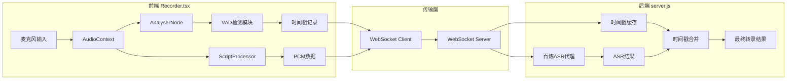

## 产品概述

实现基于能量阈值的前端 VAD（语音活动检测）功能，替代百炼 ASR 返回的不准确时间戳，确保每句话的开始/结束时间能准确反映用户实际说话的时刻。

## 核心功能

- 基于现有 AnalyserNode 的能量阈值 VAD 检测，识别语音开始和结束
- 在前端准确记录每句话的 startMs 和 endMs 时间戳
- 将前端 VAD 时间戳通过 ASR Client 传递给服务端
- 服务端优先使用前端 VAD 时间戳，替代百炼 ASR 的时间戳
- 支持静音过滤，避免录音开始前的静音被计入时间戳

## 技术栈

- 前端框架：Next.js + React + TypeScript
- 音频处理：Web Audio API（AnalyserNode、ScriptProcessorNode）
- 通信协议：WebSocket（前后端双向通信）
- 后端服务：Node.js + WebSocket 代理

## 技术架构

### 系统架构

基于现有架构进行增量修改，在前端 Recorder 组件中复用已有的 AnalyserNode，新增 VAD 检测逻辑，通过 WebSocket 消息传递时间戳到后端。



### 模块划分

- **VAD 检测模块**：基于 AnalyserNode 的能量检测，判断语音开始/结束
- **时间戳管理模块**：记录和管理 VAD 检测到的时间戳队列
- **WebSocket 通信模块**：传递时间戳和音频数据
- **后端时间戳处理模块**：接收前端时间戳，与 ASR 结果合并

### 数据流

1. 麦克风音频 → AudioContext → AnalyserNode 获取频域数据
2. checkLevel 循环中计算能量平均值，与阈值比较
3. 能量超过阈值且之前静音 → 记录 speechStartTime
4. 能量低于阈值且之前说话 → 记录 speechEndTime，生成时间戳对
5. 时间戳通过 WebSocket 发送到后端
6. 后端收到 ASR 结果时，使用对应的前端时间戳替换

## 实现细节

### 核心目录结构

```
project-root/
├── src/
│   ├── components/
│   │   └── Recorder.tsx          # 修改：新增 VAD 检测逻辑
│   └── lib/
│       └── services/
│           └── dashscope-asr-service.ts  # 修改：支持传递时间戳
└── server.js                      # 修改：使用前端 VAD 时间戳
```

### 关键代码结构

**VAD 状态接口**：定义 VAD 检测所需的状态变量，包括当前是否在说话、语音开始时间、静音持续时间等。

```typescript
// VAD 状态跟踪
interface VADState {
  isSpeaking: boolean;           // 当前是否在说话
  speechStartTime: number;       // 当前语音段开始时间
  silenceStartTime: number;      // 静音开始时间
  lastSpeechEndTime: number;     // 上一句结束时间
}

// VAD 配置
interface VADConfig {
  energyThreshold: number;       // 能量阈值 (0-1)
  silenceDurationMs: number;     // 静音持续时间阈值
  minSpeechDurationMs: number;   // 最小语音持续时间
}
```

**时间戳队列接口**：存储 VAD 检测到的每句话的开始和结束时间，用于与 ASR 结果匹配。

```typescript
// 时间戳记录
interface SpeechTimestamp {
  id: string;
  startMs: number;
  endMs: number;
}

// 时间戳队列（前端维护）
const timestampQueue: SpeechTimestamp[] = [];
```

### 技术实现方案

**1. VAD 检测实现**

- 问题：需要在不干扰现有音量显示的情况下检测语音
- 方案：复用 checkLevel 中的能量计算，添加状态机判断
- 关键技术：能量阈值比较、防抖处理（silenceDurationMs）
- 实现步骤：

1. 在 Recorder.tsx 中添加 VAD 状态 ref
2. 在 checkLevel 循环中添加 VAD 状态转换逻辑
3. 语音开始时记录 startMs，静音达到阈值时记录 endMs
4. 生成时间戳对象存入队列

**2. 时间戳传递**

- 问题：需要将时间戳与对应的 ASR 结果关联
- 方案：通过 WebSocket 发送时间戳消息，后端维护队列匹配
- 关键技术：WebSocket 双向通信、队列匹配算法
- 实现步骤：

1. 修改 DashScopeASRClient 添加 sendTimestamp 方法
2. 在 VAD 检测到语音结束时发送时间戳
3. 后端接收并缓存时间戳队列

**3. 后端时间戳合并**

- 问题：ASR 结果是异步返回的，需要与时间戳正确匹配
- 方案：按顺序匹配，每收到一个 ASR 结果就消费一个时间戳
- 关键技术：FIFO 队列、时间戳替换
- 实现步骤：

1. 在 server.js 中维护时间戳队列
2. 收到 VAD 时间戳消息时入队
3. 收到 ASR 结果时出队并替换时间戳

### 集成点

- 前端 Recorder.tsx → DashScopeASRClient：通过回调传递时间戳
- DashScopeASRClient → WebSocket：JSON 消息格式 `{ type: 'vad-timestamp', startMs, endMs }`
- server.js → 百炼 ASR：时间戳队列与 ASR 结果 FIFO 匹配

## 技术考量

### 性能优化

- VAD 检测在 requestAnimationFrame 中执行，不影响主线程
- 使用 ref 存储 VAD 状态，避免不必要的 React 渲染
- 时间戳队列使用简单数组，内存占用小

### 参数调优建议

- energyThreshold: 0.05-0.15（根据环境噪音调整）
- silenceDurationMs: 500-1000ms（静音多久算结束）
- minSpeechDurationMs: 200ms（过滤误触发）