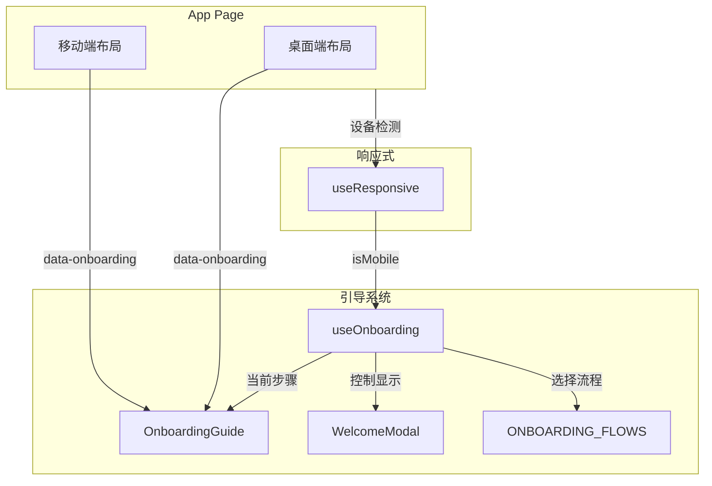

## 用户需求

用户引导系统在移动端存在适配问题，需要全面优化以提升移动端体验。

## 产品概述

优化 MeetMind 应用的用户引导系统，使其在移动端设备上正常工作并提供良好的用户体验。

## 核心问题

### 1. 移动端引导目标元素缺失

- 桌面端的 `data-onboarding="mode-switch"` 和 `data-onboarding="input-methods"` 标记在移动端布局中不存在
- 移动端使用独立的 `MobileTabSwitch` 组件和按钮组，没有添加引导标记
- 引导系统找不到目标元素时会退化为居中显示，体验不佳

### 2. Tooltip 样式未适配移动端

- `max-w-sm`（384px）在小屏手机（320-375px）上会溢出
- 固定的 `p-5` 内边距在小屏上占用过多空间
- 按钮尺寸固定，没有响应式缩放

### 3. WelcomeModal 移动端溢出

- 弹窗内容高度约 400px+，小屏手机可能无法完整显示
- 没有滚动处理机制

### 4. 位置计算未考虑移动端特性

- 固定的 16px padding 没有考虑 safe-area-inset
- 缺少对底部安全区域的适配

### 5. 引导流程缺乏设备感知

- `ONBOARDING_FLOWS` 是静态定义
- 没有根据移动端/桌面端提供差异化的引导步骤

## 核心功能

1. 为移动端布局添加引导目标标记
2. 响应式优化 Tooltip 组件样式
3. 优化 WelcomeModal 在移动端的显示
4. 适配移动端安全区域
5. 根据设备类型提供差异化的引导步骤

## 技术栈

- 框架: Next.js 14 (App Router)
- 样式: Tailwind CSS
- 状态管理: React Hooks
- 响应式检测: 已有 `useResponsive` Hook

## 技术方案

### 1. 移动端目标元素标记方案

在移动端对应的组件上添加 `data-onboarding` 属性：

- 为 `MobileTabSwitch` 组件添加 `data-onboarding="mode-switch"` 属性支持
- 为移动端输入方式按钮组容器添加 `data-onboarding="input-methods"` 标记

### 2. OnboardingGuide 响应式适配方案

```
位置计算优化:
- 引入 useResponsive Hook 检测设备类型
- 移动端使用更小的 padding (12px) 并考虑 safe-area
- 边界检测时预留底部安全区域高度

Tooltip 样式优化:
- 桌面端: max-w-sm (384px), p-5
- 移动端: max-w-[calc(100vw-32px)], p-3 sm:p-4
- 按钮使用响应式尺寸: text-xs sm:text-sm, px-3 sm:px-5
```

### 3. WelcomeModal 移动端适配方案

```
布局优化:
- 添加 max-h-[90vh] 或 max-h-[calc(100vh-env(safe-area-inset-top)-env(safe-area-inset-bottom))]
- 内容区启用 overflow-y-auto
- 移动端缩小顶部装饰区高度: h-20 sm:h-28
- 内边距响应式: p-4 sm:p-6
- 功能项响应式: p-2 sm:p-2.5, text-xs sm:text-sm
```

### 4. useOnboarding 设备感知方案

```typescript
// 新增移动端专用引导步骤
MOBILE_ONBOARDING_FLOWS: {
  recording: {
    steps: [
      // 调整步骤顺序和 position，适合移动端 UI 布局
      // 移除桌面端专属步骤或替换为移动端对应元素
    ]
  }
}

// Hook 增强
interface UseOnboardingOptions {
  isMobile?: boolean;
}

function useOnboarding(options?: UseOnboardingOptions) {
  // 根据 isMobile 返回对应的引导流程
}
```

## 架构设计

### 系统架构图



### 数据流

1. `useResponsive` 检测设备类型
2. `useOnboarding` 根据设备类型选择对应的引导流程
3. `OnboardingGuide` 根据设备类型调整样式和位置计算
4. 目标元素通过 `data-onboarding` 属性被定位

## 实现细节

### 目录结构

```
src/
├── hooks/
│   └── useOnboarding.ts        # [MODIFY] 增加移动端引导流程和设备感知
├── components/
│   ├── OnboardingGuide.tsx     # [MODIFY] 响应式样式、位置计算、safe-area 适配
│   └── mobile/
│       └── MobileTabSwitch.tsx # [MODIFY] 添加 data-onboarding 属性支持
├── app/
│   └── (main)/
│       └── app/
│           └── page.tsx        # [MODIFY] 移动端布局添加引导标记、传递 isMobile 给 hook
```

### 关键修改点

#### useOnboarding.ts

- 新增 `MOBILE_ONBOARDING_FLOWS` 定义移动端专用引导步骤
- Hook 接受 `isMobile` 参数，返回对应设备的引导流程
- 移动端录音引导步骤顺序调整: record-button -> input-methods -> mode-switch
- 移动端步骤的 position 优化为适合垂直布局的 'bottom' 或 'top'

#### OnboardingGuide.tsx

- 引入 `useResponsive` 获取设备信息
- Tooltip 样式响应式: `max-w-sm sm:max-w-sm max-w-[calc(100vw-32px)]` -> 移动端优先
- 内边距响应式: `p-3 sm:p-5`
- 按钮响应式: `px-3 sm:px-5 py-1.5 sm:py-2 text-xs sm:text-sm`
- 位置计算时移动端 padding 减小为 12px
- 底部边界检测增加 safe-area 考虑 (34px for iPhone notch)

#### WelcomeModal

- 容器添加 `max-h-[90vh]`
- 内容区添加 `overflow-y-auto`
- 顶部装饰 `h-20 sm:h-28`
- 内边距 `p-4 sm:p-6`
- 按钮 `py-2 sm:py-2.5`

#### MobileTabSwitch.tsx

- Props 新增可选 `data-onboarding?: string`
- 容器 div 添加该属性

#### page.tsx

- 移动端输入方式按钮组容器添加 `data-onboarding="input-methods"`
- MobileTabSwitch 传递 `data-onboarding="mode-switch"`
- useOnboarding 调用时传递 `{ isMobile }`

## Agent Extensions

### Skill

- **vercel-react-best-practices**
- 用途: 确保 React 组件修改遵循性能最佳实践，避免不必要的重渲染
- 预期成果: 响应式适配代码性能优化，避免引入性能问题

- **frontend-design**
- 用途: 优化移动端 UI 组件样式，确保响应式设计的视觉效果
- 预期成果: 移动端引导组件样式美观、适配良好

### SubAgent

- **code-explorer**
- 用途: 在修改过程中探索相关组件的引用关系，确保改动完整性
- 预期成果: 识别所有需要修改的文件和引用点