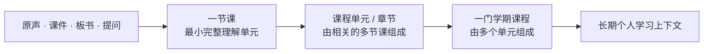
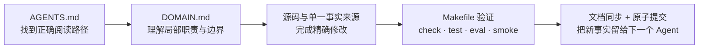

# MeetMind

> **真正懂你在学什么的 AI 同学。**

MeetMind 是一个以学习者长期上下文为中心的 AI 学习产品。

你可以像发微信一样，把课堂录音、视频、文章、图片、文件和一闪而过的想法交给 MeetMind。它先安静地收下，理解内容，也理解你正在学什么；当你需要时，再带回有依据的解释、复习动作和下一条真正有用的信息。

**在线体验：[capture.meetmind.online](https://capture.meetmind.online)**

第一次打开可以直接选择“先试听一节课”，无需先准备自己的课堂内容。

当前最聚焦的场景是课堂：录下一节课，课中有一位真正听着同一节课的 AI 同学陪你；课后从老师原话出发，解释、定位、复述、检验，并把这节课变成可以继续学习或递给同学的内容。

---

## MeetMind 想解决什么

学习资料从来不只存在一个地方。

它散落在课堂录音、课程视频、老师的 PPT、微信里收到的文章、随手拍下的板书、收藏夹和脑子里来不及整理的问题中。传统笔记工具只能保存文件，通用聊天机器人通常只看见你这一次发来的内容。

MeetMind 希望建立的是连续的学习上下文：

- 知道这句话来自哪节课、哪个时间点；
- 知道你刚才没有跟上的概念；
- 知道这节课和前几周的内容有什么关系；
- 知道你已经做过哪些练习，哪里仍然不稳；
- 下一次见面时，不必重新认识你。

它不是一个“帮你生成更多内容”的 AI 工具箱，而是一位会随着真实学习过程逐渐理解你的同学。

---

## MeetMind 的上下文理念

### 1. 好的输出，来自三种智能条件相加

> **好的输出 = 个人上下文 + 场景上下文 + 好的模型智能**

这不是一个技术公式，而是 MeetMind 判断产品价值的基本模型：

| 组成 | 它回答什么问题 | 例子 |
|---|---|---|
| **个人上下文** | “这是怎样的学习者？” | 目标、阶段、长期困惑、掌握情况、学习节奏、收藏与反馈 |
| **场景上下文** | “此刻具体发生了什么？” | 这一节课的原声、转录、课件、板书、当前进度和老师刚讲的内容 |
| **模型智能** | “基于这些信息，现在最应该怎么帮？” | 理解真实意图，判断是解释、定位、复述、连接还是检验 |

只有模型，没有上下文，回答很容易正确却泛泛；只有场景上下文，AI 能听懂这节课，却不一定懂这个学生；只有个人上下文，没有眼前的真实材料，又容易脱离当前问题。三者同时存在，输出才会既聪明、又相关、还有根据。

这也对应 MeetMind 的提示词哲学：产品负责给模型真实、完整、边界清楚的上下文和必要的渲染契约，不用大量规则替模型做判断。模型越强，MeetMind 从同一份上下文中产生的价值也应该越高。

场景上下文可以在明确边界下分享，例如把一节课交给同班同学继续提问；个人上下文默认私有，不跟随分享流出。

### 2. 产品有两条主线

| 主线 | 用户心智 | 主要沉淀 |
|---|---|---|
| **收集线** | “我先随手发给 MeetMind。” | 日常零散的文字、语音、图片、链接、收藏、想法和反馈，逐渐形成长期个人上下文 |
| **课堂线** | “帮我真正理解这一节课。” | 围绕一节课保留完整学习现场，形成有原声、有结构、可复习的场景上下文 |

两条线不是两个孤立产品。收集到的文章、图片和问题可以补进某节课；课堂中暴露的困惑、练习结果和关注点，也会继续丰富个人上下文。一个负责接住散落在日常里的学习，一个负责把完整课堂理解透。

### 3. 一节课，是最小的完整理解单元

MeetMind 不把内容组织成一堆互不相干的文件。课堂内容按照学习本身的结构逐步生长：



用户首先理解一节具体的课；相关的多节课组成一个课程单元或章节；多个单元再组成一门学期课程。这样，AI 不只知道“你存过哪些文件”，还知道一个概念在哪节课出现、如何跨课发展，以及它在整门课程中处于什么位置。

---

## 一条完整的产品路径

### 1. 先收下学习现场

MeetMind 支持从不同入口接住内容：

- 录制线下课堂、讲座和讨论；
- 录麦克风、电脑声音，或两路同时录制；
- 导入音频、视频、图片、PDF、PPT、Word 和文本文件；
- 收下 B 站、YouTube、网页文章等链接；
- 从微信服务号发送文字、语音、图片和链接；
- 用手机拍一下，或速记一句想法和疑问。

用户不需要先整理目录、设计标签或学习提示词。内容怎么来的、原始出处是什么、正文是否完整，都会作为证据保留下来。

### 2. 微信服务号，是随手收集的轻入口

> **在微信关注「MeetmindAI 原生专属导师」服务号，绑定 MeetMind 账号后，就可以把学习内容随手发给自己的 AI 同学。**

很多学习内容本来就发生在微信里：群里转来一篇文章、走路时突然想到一句话、拍下一页书，或者用语音记下刚刚没想明白的问题。用户可以直接把这些内容发给服务号，不必先打开网页，也不必当场整理。

使用方式很简单：

1. 在微信关注「MeetmindAI 原生专属导师」服务号；
2. 按服务号提示绑定自己的 MeetMind 账号；
3. 像发消息一样发送文字、语音、图片或链接；
4. 点击服务号回执，回到同一个学习工作区继续整理。

MeetMind 会先在微信里确认收到，再在后台继续处理：

- 文字直接进入个人收集流；
- 语音保留原话，并继续生成可用的文字内容；
- 图片作为真实原件保存，之后可以和问题、课程及笔记连接；
- 网页、公众号文章和视频链接继续读取标题、正文或内容信息。

这些内容会进入用户在 MeetMind 的同一个学习工作区。回到网页后，可以接着把它们整理成笔记、围绕内容提问、补充到一节课，或用于后续复习。微信负责“随手发”，网页负责更深入的整理与学习。

### 3. 课中，有一位真的在听的同学

当课堂开始后，MeetMind 才会让“同学”出现。它不是一个没有上下文的聊天窗口，而是和你听着同一段内容：

- 实时转录课堂原声；
- 根据最近讲到的内容理解“这个”“刚才那段”等指代；
- 点击自然问题，快速解释当前概念；
- 回答紧贴老师正在讲和刚刚讲过的内容，不把你带离正在进行的课堂；
- 支持中英文课堂即时翻译；
- 多人课堂模式可区分不同说话人；
- 拍下板书和课件，作为当前课堂的补充材料。

课中交互保持克制。你可以随时问，也可以完全不操作，让它安静地听完整节课。

### 4. 课后，左边有根，中间练习，右边有人陪

录课结束后，MeetMind 不只给出一篇摘要，而是保留完整学习现场：

- 左侧是原始音频或视频、转录和可点击时间锚点；
- 中间是基于这节课生成的练习与学习内容；
- 右侧是能继续解释和复盘的 AI 同学；
- 同学回答里的 `[MM:SS]` 时间引用可以点击，跳回老师当时的原话。

所有关键判断都应该能回到原件。学生看到一个结论时，可以立即确认老师当时究竟说了什么，而不是被迫相信一段没有出处的 AI 文本。

### 5. 内容会长成可使用的学习应用

同一份课堂上下文可以按需要变成不同的学习动作：

- 闪卡：练习主动回忆；
- 测验：检验是否真正理解；
- 思维导图：看清概念关系；
- 速查表：压缩考试前最需要的内容；
- 信息图：把结构复杂的内容视觉化；
- 音频概览：在通勤和走路时继续复习。

MeetMind 会突出一个“现在最适合”的动作，而不是要求用户先理解所有工具。应用是学习上下文的不同用法，不是彼此割裂的功能入口。

### 6. 学习上下文会逐步接起来

课堂、收藏、笔记、目标、练习结果和“有用 / 不相关”反馈会逐渐形成个人上下文。

因此，MeetMind 可以：

- 发现不同课程和资料之间的内部关联；
- 记住持续出现的困惑和术语；
- 在新课堂中接住上一节课留下的问题；
- 从真实网页、论文和图书目录中寻找值得继续看的外部信息；
- 解释为什么这条信息此刻与你有关。

没有足够好的内容时，系统宁可少给，也不为了填满信息流而推荐泛泛的资料。

### 7. 分享的不只是文件，而是一段可以继续对话的上下文

一节课的场景上下文可以变成 Shared Agent。

同学在班级群里打开分享链接后，不只能看一张静态笔记，还可以匿名围绕那节课继续提问。登录后，才会把它领取到自己的学习工作台，并在自己的空间里继续做练习。

分享采用快照：分享之后，原作者新增的私人对话和个人画像不会进入已经发出去的内容。场景可以共享，个人学习状态默认保持私有。

---

## MeetMind 与普通 AI 笔记工具的区别

| 普通 AI 笔记工具 | MeetMind |
|---|---|
| 一次处理一个文件 | 让课堂、资料、目标和反馈形成连续上下文 |
| 等用户写提示词 | 从学习现场直接判断当下可能需要什么 |
| 生成摘要后结束 | 继续进入解释、练习、复习和下一节课 |
| 回答看起来正确，但出处不清楚 | 课后时间引用和来源引用可以回到真实原件 |
| 每次对话重新开始 | 随着使用逐渐理解课程、习惯和薄弱点 |
| 分享一份静态文档 | 分享一个能围绕场景继续对话的上下文 |

真正的个性化不是注册时选择几个标签，而是产品从用户的真实学习行为中自然长出理解。

---

## 产品原则

### 安静

不靠通知、弹窗和任务红点制造焦虑。大部分时间，MeetMind 应该像桌边的一盏灯，而不是不断催促的管理系统。

### 回来的比发出去的更好

用户发出去的是一段原声、一张板书或一个链接；回来时，它已经被理解、整理，并能继续用于学习。

### 小

先给一个真正有用的发现或动作，而不是一份看似完整、实际没人读完的长报告。

### 有根

解释、总结和推荐必须能说明自己从哪里来。原件、引用、时间点和来源状态是产品可信度的一部分。

### 智能是第一印象

视觉保持克制，让用户最先感受到的是“它真的懂我在学什么”，而不是功能数量或装饰效果。

---

## 隐私与可信边界

- 课中回答优先基于正在发生的真实转录和资料，课后引用才提供可点击时间锚点；
- 外部推荐必须先有真实可访问的网页、论文或图书来源；
- 解析失败时保留原件，并诚实标明正文是否完整；
- Shared Agent 默认不携带原作者或访问者的个人画像；
- 分享内容采用不可变快照，不会悄悄同步分享后的私人变化；
- 个人薄弱点、学习节奏和私人对话默认不作为公开分享内容。

---

## Agent-native：让软件本身适合 Agent 理解和维护

MeetMind 不只是在产品里使用 AI，也在用一种 **Agent-native 的方式构建软件**。

随着功能和上下文增加，单靠一份巨大的开发文档或少数人的记忆，很难长期保持一致。代码库因此被设计成一套对人类和 Coding Agent 都清晰的知识结构：Agent 能先理解一个领域的职责和边界，再做局部修改，最后通过固定验证流程确认没有破坏产品主链路。

### 不同文档服务不同读者

| 文件 | 主要读者 | 作用 |
|---|---|---|
| [`README.md`](./README.md) | 用户、合作方、贡献者 | 认识 MeetMind 是什么、为什么存在、现在能做什么 |
| [`AGENTS.md`](./AGENTS.md) | Coding Agent 与开发者 | 任务阅读路径、架构全貌、设计铁律、Golden Commands |
| `src/**/DOMAIN.md` | 正在修改某个领域的 Agent | 该目录的职责、依赖边界、关键文件和真实数据流 |
| [`skills/`](./skills/) | 执行任务的 Agent | 变更、调试、架构检查和代码审查的标准流程 |
| [`docs/`](./docs/) 与 [`roadmap/`](./roadmap/) | 产品与技术决策者 | 深入的产品定义、技术链路和阶段性决策 |

README 不承担 Agent 的详细操作说明；Agent 接手仓库后的第一入口始终是 [`AGENTS.md`](./AGENTS.md)。

### 这个架构为什么对 Agent 友好

- **领域地图**：重要目录都有 `DOMAIN.md`，不用从整个仓库猜测职责；
- **单一事实来源**：用户文案、模型配置、Prompt、应用目录和渲染契约都有明确归属；
- **稳定依赖方向**：页面、组件、Hook、服务、存储之间保持清晰边界；
- **共享底座**：对话、应用渲染、引用和上传能力复用统一组件，不在每个入口重复实现；
- **文档与代码一起交付**：公共契约或用户流程变化时，必须同步对应文档；
- **可验证修改**：类型检查、单元测试、Smoke Test、ASR/Tutor Eval 和回归基线共同构成质量门；
- **原子提交**：每次变更保持可解释、可回滚，方便后续 Agent 继续工作。



Agent-native 在这里不是“让 Agent 随便改代码”，而是让每次修改都有足够上下文、明确边界和可重复验证。

---

## 技术架构概览

| 层 | 主要技术与职责 |
|---|---|
| Web | Next.js 14、React 18、TypeScript、Tailwind CSS |
| 对话与生成 | Vercel AI SDK v6、统一 Tutor Agent、多模型注册表 |
| 课堂语音 | DashScope 实时与长音频 ASR、可选腾讯云说话人分离 |
| 服务端数据 | Prisma + SQLite，保存用户、Workspace、分享与同步数据 |
| 客户端数据 | Dexie / IndexedDB，承载转录、本地缓存和离线状态 |
| 学习应用 | 统一 App Plugin 契约与 AppRenderSurface 渲染层 |
| 质量保障 | TypeScript、Vitest、Smoke Test、ASR/Tutor Eval、Sentry、pino |

产品层只负责提供高质量上下文、工具和渲染契约，把理解与判断尽可能交给模型；同时用证据、评测和软件边界约束不可接受的结果。

---

## 本地运行

如果你要参与开发，请先阅读 [`AGENTS.md`](./AGENTS.md)，再执行：

```bash
git clone https://github.com/xiaojinyu868-w/meetmind.git
cd meetmind
npm install
cp .env.example .env

make dev       # 默认 http://localhost:3001
make check     # 每次改动后必跑
```

环境变量、模型选择、ASR、微信接入和部署说明以 [`.env.example`](./.env.example)、[`AGENTS.md`](./AGENTS.md) 及对应 `DOMAIN.md` 为准，README 不重复维护易过期的配置清单。

常用质量命令：

```bash
make test
make eval
make smoke-all
make build
```

---

## 进一步了解

- [产品判断基线](./docs/PRODUCT_THESIS_2026.md)
- [Shared Agent 与场景上下文](./roadmap/v3.0-virality-agent.md)
- [Tutor Agent 架构](./docs/TUTOR_AGENT.md)
- [ASR 课堂语音链路](./docs/ASR_PIPELINE.md)
- [应用矩阵产品定义](./docs/APPLICATION_MATRIX_PRD.md)
- [设计与提示词哲学](./项目开发文档/提示词设计哲学.md)
- [版本记录](./CHANGELOG.md)

---

## 当前状态

MeetMind 正在持续开发中，当前优先把“录下一节课 → 当场听懂 → 课后练习 → 下一节继续记得”做成稳定、自然的完整闭环。

部分跨设备同步、外部内容接入和长期学习能力仍在持续完善。生产体验以 [capture.meetmind.online](https://capture.meetmind.online) 为准。
