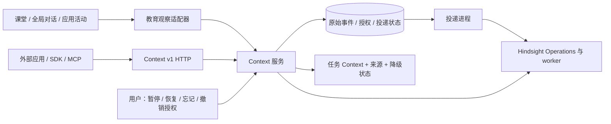

# MeetMind Context M1：实现与验收交接

> 2026-09-08。M1 底座与画像页面可用于服务器集成；一条真实模型合成旅程通过，V1 尚未完成。服务器接管请读 [CONTEXT_SERVER_HANDOFF.md](./CONTEXT_SERVER_HANDOFF.md)，最新运行结果以其中链接的交付报告为准。目标规格见 [LEARNING_MEMORY_V1_SPEC.md](./LEARNING_MEMORY_V1_SPEC.md)，本页只描述已经实现的行为。

## 这次交付的形态

这是通用的、以用户为中心的跨应用 Context 核心，教育通过独立适配器进入。核心没有固定知识点本体、掌握分数或 24 条存储上限。应用提交原始经历，后续应用按当前任务读取有来源的理解。系统保证身份、授权、来源和可靠投递；整理与检索复用 Hindsight。



| 实物 | 已实现行为 | 入口 |
|---|---|---|
| 通用服务 | 原始事件、幂等、分页、任务读取、来源、处理状态、受限授权 | `src/lib/services/context/DOMAIN.md` |
| HTTP | 版本化协议；身份来自凭证；无 Next 依赖的 Request/Response 转换 | `src/app/api/context/DOMAIN.md` |
| 用户页面 | 新增 `/context`，自动有来源的理解卡、学习轨迹、证据弹层、任务试读；补充自述与授权为次级操作 | `src/components/context/DOMAIN.md` |
| 独立投递进程 | 原子接收、租约、重启恢复、固定上游 operation ID、清理进度 | `make context-worker` |
| TypeScript SDK | 零运行时依赖，完整读写与管理接口，公共类型单一事实源 | `packages/context-sdk/DOMAIN.md` |
| MCP | 官方 TypeScript SDK 与 stdio，prepare/append/source/job 四个工具 | `packages/context-mcp/DOMAIN.md` |
| 接入 Skill | 授权、读历史、写原始经历、重试与来源使用约定 | `packages/context-skill/SKILL.md` |
| 独立应用示例 | 另一个进程通过受限 token 读取；显式提供事件文件时先写入再读取 | `examples/context-client/DOMAIN.md` |

当前 HTTP 服务仍由 MeetMind Next 进程承载，数据库和 owner 登录适配器复用现有项目；未宣称已独立部署成另一套服务。SDK、MCP 和 Skill 为可检查的源码交付，尚未发布 npm 或安装到开发者机器。

## 已接上的内部生产者和消费者

`CONTEXT_ENABLED=true` 开启灰度接入：

- 课堂：课后理解完成后，经 `learning-observation-service.ts` 持久化活动观察。等待数据库接收，不等待后台记忆模型。
- 全局对话：登录用户回合经 `/api/memory/events` 写入，保留 user/assistant 角色；global Tutor 在本轮读取任务相关 Context。shared、访客、仅当前课堂与其他 Tutor 模式不读取个人 Context。
- 应用矩阵：桌面、移动与独立应用页由 `useAppLearningActivity` 提交活动；结果按用户和产物去重，重复交互分次记录。测验附带完整题面、选项、实际提交答案、参考答案来源、评分依据与课堂引用；看参考答案后的主观题自评单独标注，未采集的实际答案保留 null。当前页面内复练标注已看参考答案，其他会话是否看过保留 unknown。闪卡等尚未提供完整 observation 的应用仍沿用 240 字摘要。

开关关闭时沿用旧事件管道。新旧数据不双写；旧画像和「我的上下文」尚未迁移。浏览器活动提交目前为后台尝试，离线重载前的未确认事件没有持久化 outbox；只有收到服务端回执，才进入可靠投递保证范围。

## 开源提供什么，我们保证什么

| Hindsight 提供 | MeetMind 提供 |
|---|---|
| 记忆提取、归并、检索和来源事实链 | 用户/应用/空间权限、原始内容与用户控制 |
| 异步 retain、Operations、上游 worker 和重试 | 本地接收与上游投递之间的可靠衔接 |
| 模型与存储配置 | 与具体应用解耦的 API、SDK、MCP 与 Skill |

适配器根据 [官方 OpenAPI](https://hindsight.vectorize.io/openapi.json) 的 0.9.2 契约实现，未 fork 上游。测试中的上游响应是显式替身；没有真实服务时，不能据此证明上游部署、提取质量或模型效果。

每个用户与空间对应独立 bank；tags 不作为权限边界。召回后的全部来源必须能回到当前用户获准且仍 active 的原始事件。来源缺失、成环、跨空间或被暂停，相关理解会被排除。读操作在远端返回后再次检查撤销状态。

暂停/忘记立即停止本地参考。后台先等待已发送操作终止，再删除 document 与关联记忆，最后删除可能保存原文 payload 的终态 operation。清理阶段持久化，回执丢失后可继续。上游无法确认曾经是否接收时，`cleanupPending` 会保留，不能显示“已彻底清除”；备份保留周期仍需部署方另行管理。

`afterEventId` 优先考虑该次写入，不会被近期读取窗口挤掉；文本预算不足仍保留 source 句柄。它不等待模型完成。`pendingEventIds` 表示本次选取的待处理来源，不是全库任务统计。

## 本地启动

使用 Node 24，并通过 Makefile 命令运行。现有运行时固定使用仓库下 prisma/meetmind.db；Prisma CLI 从进程环境或 .env 读取 DATABASE_URL，不能假设它会加载 .env.local。初次本地数据库准备（PowerShell）：

```powershell
$env:DATABASE_URL = 'file:' + (Join-Path (Get-Location) 'prisma/meetmind.db').Replace('\','/')
make db-push
```

API 与投递进程均从同一仓库目录启动。已有生产数据库的变更应在部署流程中处理。

配置文件中设置真实的登录签名秘密与灰度开关：

```dotenv
JWT_SECRET=<本地生成的随机签名秘密>
CONTEXT_ENABLED=true
# 接入自己的服务后再配置；模型凭证由 Hindsight 自己管理
CONTEXT_HINDSIGHT_URL=http://127.0.0.1:18888
CONTEXT_HINDSIGHT_API_KEY=<按上游部署要求设置>
```

未配置 Hindsight URL 时，事件仍可接收；任务读取返回 `degraded: true` 与原始观察，`memories` 不伪造理解。已配置时，分开运行：

```bash
make dev
make context-worker
```

本仓库已经提供独立的开发联调 Compose（`ops/hindsight/compose.yaml`），固定使用官方 Hindsight `0.9.2` 镜像；它只映射宿主机 `127.0.0.1:18888`，不会替换 MeetMind 应用或生产数据库。上游部署参考 [Hindsight 安装文档](https://hindsight.vectorize.io/developer/installation)。生产部署需固定上游 worker 身份 `HINDSIGHT_API_WORKER_ID`，避免主机名变化导致已排队操作失去归属；为上游准备模型凭证及持久化存储。服务器独立实例已完成一次真实 retain → operation → recall → document/operation 清理验证，效果对照记录见 [CONTEXT_EFFECT_CHECK_2026-09-07.md](./CONTEXT_EFFECT_CHECK_2026-09-07.md)。

开发联调步骤：

```powershell
Copy-Item ops/hindsight/runtime.env.example .env.hindsight.local
# 编辑 .env.hindsight.local，填写 HINDSIGHT_SERVICE_KEY 与有效的 HINDSIGHT_DASHSCOPE_API_KEY
make hindsight-up
make hindsight-status
```

然后在 MeetMind 的服务端环境设置 `CONTEXT_HINDSIGHT_URL=http://127.0.0.1:18888` 与同一个 `HINDSIGHT_SERVICE_KEY`（变量名为 `CONTEXT_HINDSIGHT_API_KEY`），再分别运行 `make dev` 和 `make context-worker`。Hindsight 模型密钥放在自己的部署环境；MeetMind Tutor 的模型凭证由应用环境管理。上游服务密钥不得进入 SDK、MCP 客户端或浏览器。

打开 `/context`，登录后记录一段真实学习经历，再输入接下来的学习任务。原始观察与模型理解分开展示，来源可单独展开。暂停记录后再次读取，相关原文与派生理解均应停止返回。

本次本机使用 `http://127.0.0.1:45673/context`；开发服务器端口通过 PORT 设置。忽略目录 `out/dev-tools/` 内有本轮使用的 Node 24 与 GNU Make，未作为项目依赖提交。

## 开发者怎样接入

用户在 `/context` 的应用授权区域创建授权，默认只读、personal 空间、7 天有效。需要回写时明确授予 write。token 仅创建时显示一次，数据库只保存散列。开发者后端通过环境注入 token；不把用户 owner JWT 或上游密钥交给应用。

```dotenv
MEETMIND_CONTEXT_URL=http://127.0.0.1:45673/api/context/v1
MEETMIND_CONTEXT_TOKEN=<用户授予的 mmctx_ 凭证>
MEETMIND_CONTEXT_TASK=为下一次条件概率练习准备背景
```

环境变量直接传入运行进程：`make context-example` 默认只读取，`make context-mcp` 启动 stdio MCP。示例设置 MEETMIND_CONTEXT_EVENT_PATH 为 ContextEventInput JSON 文件时，先写入明确提供的经历再读取；不会自动生成学习结果。需要写入的宿主应用调用 SDK：

```ts
const receipt = await client.append({
  schemaVersion: 1,
  clientEventId: interaction.id,
  type: 'practice.attempt',
  occurredAt: interaction.occurredAt,
  content: JSON.stringify(interaction.observedEvidence),
  source: { title: interaction.title, externalId: interaction.id },
});
const bundle = await client.prepare({
  task: { intent: '选择下一道练习及讲解方式' },
  afterEventId: receipt.eventId,
});
```

这里的 interaction 来自应用实际发生的互动；重复投递保持同一 ID、时间和内容。应用自行使用 Context 决定教学，不把历史内容当成系统指令。SDK 不擅自重试授权创建。

## 验收证据

新鲜结果和截图集中在 [CONTEXT_LOCAL_READINESS_2026-09-08.md](./CONTEXT_LOCAL_READINESS_2026-09-08.md)。26 项 Context 单测通过，Tutor dry-run 26/28。真实链路曾通过一轮9项检查，包含明确偏好更新与终态操作清理；最新视觉验收见该报告。不能用历史全仓测试数字替代当前验证。

历史记录：make test 的187文件/1379项、make smoke-context 的12项，来自此前实现阶段；该 smoke 的测验生成是 fixture、后端是明确降级。旧6f58…真实运行没有验证纠正语义，不再把它当作纠正有效的证据。

TTFT 最新抽样（每mode一次）goal15601ms、review984ms、in-class897ms；shared因分享fixture缺失404。它不是统计性能验收，也未覆盖global共享Context额外延迟。全仓lint历史178条warning、0error导致gate失败；不声称全仓lint通过。
## 距离 V1 还差什么

1. 连续产品验收已有一轮可复现证据：课堂观察、测验 UI 和 Tutor 在同一合成账户中连续使用真实 Context；带历史与 current-only 对同一任务产生不同回答，暂停/恢复/忘记和上游清理均已验证。仍需在真实用户轨迹中检验教学收益与纠正策略。
2. 将新入口融入原「我的上下文」，完成旧数据迁移与对模型理解的纠正语义；当前用户控制针对原始来源。
3. 在测验生成与 AI 家教 teach 线使用 Context，并扩展闪卡等应用的原始过程采集。测验题面、实际客观题答案、自评条件和当前页面内复练条件已接入；主观题界面本身没有采集文字答案，不能用自评代替。当前课堂/对话/测验写入与 global Tutor 读取已连接；teach 线和测验生成消费仍待接入。
4. 补浏览器未确认事件的离线投递，并将独立读写示例做成真实学习应用。当前示例接收明确提供的事件文件，单独进程的跨应用读写已通过合成场景验证。
5. 独立部署、公开包发布、OAuth 授权与开发者运营另行推进。统一支付、分账、流量分配和软件自进化框架尚未实现。

本轮没有构建记忆效果排行榜或新评测体系，没有部署主应用。用户随后授权提交推送，Git交付分支为 `feat/context-m1-handoff`，与继续演进的 `feat/settings-redesign` 分开，供服务器AI合并。独立 Hindsight 开发实例已部署并参与联调。当前代码是可审阅、可运行的 M1 底座，不是已完成的 V1 产品。
