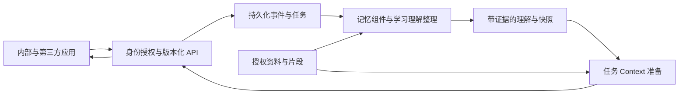

# MeetMind 共享学习记忆系统：交付规格

> 日期：2026-09-05；实现状态更新于 2026-09-07。状态：V1 目标规格，M1 底座已实现，V1 尚未完成。当前能力与验收以 [CONTEXT_M1_DELIVERY.md](./CONTEXT_M1_DELIVERY.md) 为准。
> 产品名暂沿用 MeetMind Context；用户入口沿用「我的上下文」。
> 本文规定目标行为和建设顺序。下文示意接口与对象不能直接当成已实现 API；真实类型见 packages/context-sdk/src/types.ts，接口见 src/app/api/context/DOMAIN.md。
> 来源：本轮用户关于独立应用群、共享 Context、开发者生态的讨论。用户优先要求先做好产品，记忆效果评测与排行榜建设后置；基础正确性、权限与故障恢复检查仍需完成。
> 设计修订：同日根据用户对 The Bitter Lesson 的质疑，补充 §1.1。系统边界保持确定，记忆内容的组织与学习判断保持开放；后文对象是存储/交换职责，不是必须复刻的人类认知模型。

## 1. 最终交付是什么

**一套以用户为中心、能够跨应用读写、带来源且可由用户控制的学习 Context 服务。**

用户每完成一次学习，都有机会让后续应用更了解自己的目标、经历与理解变化。新应用在获得授权后，可以直接使用相关 Context，同时贡献新的学习经历。没有历史时，应用依靠当前任务与材料正常提供价值。

系统的三份交付物：

| 交付物 | 实际形态 | 完成后能做什么 |
|---|---|---|
| 用户的学习记忆 | 现有「我的上下文」及应用内按需展开的来源入口 | 看见系统如何理解自己、回到学习现场、纠正、暂停、忘记、管理应用授权 |
| 独立 Context 服务 | 版本化 HTTP 接口、持久化后台处理、资料访问与记忆组件适配层 | 接收学习经历，形成可追溯理解，为不同任务准备 Context；不依赖某个应用 UI 或 Agent 框架 |
| 开发者接入包 | TypeScript SDK、MCP、接入 Skill、独立示例应用、运行说明 | 让新应用通过同一套授权接口完成读取、使用、回写；无须导入 MeetMind 业务代码 |

V1 完成条件：内部课堂、家教、测验形成连续体验；另有一个独立运行的示例应用，经 HTTP 和真实授权读写同一份 Context。SDK、MCP、Skill 都调用实际服务。代码、运行配置、文档和演示步骤可复现。

受控开发者接入属于 V1。公共开发者市场、流量分配、收费分账、正式公开发布属于后续生态阶段。统一身份与权益通过适配边界连接，V1 不重写现有登录和支付系统。

### 1.1 模型能力边界：少规定理解方式，保留发现能力

设计依据：Sutton 的 The Bitter Lesson 讨论能随计算规模增长的通用搜索与学习方法，相比手工编码领域知识的长期优势。将它用于当前产品架构是一条设计启发，不是对某种数据库、JSON 或检索架构的实验结论。调用 LLM 整理笔记，也不等同于实现了原文意义上的可扩展学习。

| 由系统保证 | 由模型决定，可随能力迭代 |
|---|---|
| 用户、应用、权限、来源、时间、版本、幂等、删除与实际资源预算 | 什么值得记住、如何归组、如何概括、哪些经历存在联系 |
| 观察记录与推断的来源区分，原始资料可重新读取 | 学生当前理解怎样、需要补充什么证据、历史对本次任务有什么帮助 |
| 最小工具/交换/界面契约，模型写入不能绕过授权 | 记忆笔记的内容与层级、何时合并或重新整理、按需展开哪些材料 |

实现约束：

- 学习理解先使用开放的自然语言内容与证据引用，分类、知识关联与其他属性可选；不先构建完整教育本体、固定掌握分数或教学状态迁移规则。
- 事实类型如“提交答案”“使用提示”是交互记录，不是“学生已经掌握”的认知判断。例子中的课堂→家教→测验用于演示，不成为每个用户必须执行的学习路径。
- 原始经历、可更新的记忆笔记/索引、当前请求的 Context 是不同数据职责，不要求模型把认知切成固定的短中长期槽位，也不要求每次请求经过同一串 LLM 调用。
- 记忆摘要是读取加速与索引，不能成为访问原始经历的唯一通道。授权与预算允许时，模型可搜索、打开来源、继续检索，发现初次整理遗漏的信息。
- 模型可提出记忆的新增、合并与改写，通过最小内容/引用/版本契约提交；服务验证权限与来源引用合法性，不能把引用合法误认为结论已被证明。
- 保存容量不受“每人 24 条”限制；“每轮恰好/最多几条”不作为产品语义。调用成本和输入长度通过可配置预算管理，预算不足要保留来源和继续读取的机会。
- 教师方法和开发经验作为可检索案例、可替换 Skill 或后续学习材料积累，不预先变成应用都必须执行的永久规则。
- 选用开源组件同样检查其信息瓶颈：更强模型、更多获准计算能否读取更丰富证据、改进整理与检索；不以“接了 LLM”或“用了知识图谱”替代这个判断。

第一段实现收敛为：可靠的经历与资料记录 + 可替换的模型整理/检索组件 + 有来源的任务 Context + 用户控制。复杂领域分类和推理编排在具体体验需要时再加入。

### 1.2 产品定位：通用核心，教育优先交付

核心定位是以用户为中心的跨应用 Context 服务。基础协议表达用户、应用、空间/任务、内容、来源、权限与时间，非教育应用也能使用。当前只通过教育应用把它做完整，不提前实现所有行业的能力。

教育能力作为独立接入包提供：课堂/练习/批注等观察适配器、教材与课堂的来源定位、教学案例与 Skill、不同教育应用使用 Context 的参考实现。课程、知识点、作答条件是教育扩展信息，不是每个记忆调用的必填字段。

本文 LearningEvent、MemoryAssertion 等名称描述教育业务中的职责，不要求在开源组件之外另建同名数据库和理解流程。公共类型在实现时使用中立命名，保留原业务类型作为教育适配。移除教育接入包后，核心仍应能为写作或项目协作应用提供同样的读写、来源与授权能力。

复用顺序：使用上游现成能力 → 配置与扩展点 → 薄适配 → 对确实缺失的产品能力补实现。只有出现可复现的限制，才考虑 fork 或替换；不为了形成自有代码而重写成熟组件。

## 2. 用户最终看到的样子

沿用 `docs/LEARNING_CONTEXT_PRODUCT.md` 的「总览 → 具体内容」结构，不增加需要学生维护字段的数据库界面。以下为内容示意，实际 UI 文案实施时收口到 `src/lib/ui/copy.ts`。

```text
我的上下文

正在继续：下周的概率论考试

对我的理解
  条件概率的基本计算已有进展，贝叶斯问题的迁移还需要确认。
  来自：周一课堂提问、周二家教练习、周四测验
  [查看依据与变化] [纠正] [暂停参考] [忘记]

课程与考试 →                 最近学习现场 →
应用访问与授权 →
```

- 默认安静整理，不要求每一条候选记忆都弹窗确认；缺乏证据的结论不升级为稳定理解。
- 总览展示当前有用的信息，历史通过展开查看；展示条数和模型输入预算不决定底层保存条数。
- 来源可回到具体课堂时间、对话轮次、题目或材料段落；来源只有摘要时如实标明。
- 应用内仅在相关时提供「参考了哪些历史」入口，不重复宣告“我记得你”。
- 当前明确意图优先于历史偏好；过去需要基础讲解，不妨碍用户现在要求直接进入推导。
- 无历史不制造画像、不强制问卷；访客维持当前本地体验，登录后的历史同步遵循明确的同步范围。
- 用户能查看应用的可读范围、可写范围与访问记录，撤回后服务立即停止该授权的新读取和写入。

## 3. 用一段学习过程定义真实行为

同一用户、同一课程，在三个应用中发生：

| 步骤 | 实际发生 | 系统应保存或返回 | 后续体验 |
|---|---|---|---|
| 课堂 | 学生说分不清条件概率与联合概率 | 原话、所在片段、课程、时间；形成有依据的待解决问题 | 家教可以从该区别开始，而非重新询问全部背景 |
| 家教 | 看树状图、用两次提示后答对 | 题目、学生答案、提示次数、展示方式与结果 | 当前理解记录进展及条件，不宣称已经独立掌握 |
| 测验 | 独立答对同类题，但贝叶斯迁移题出错 | 分开的作答证据与知识关联 | 调整需要继续练习的范围，保留以前的变化轨迹 |
| 新应用 | 打开一篇相关论文 | 授权范围内的相关理解、任务信息及材料引用 | 能连接已学内容，针对尚未确认的推导提供支撑 |

教学方式与结果先作为共同发生的事实保存。单次答对不足以证明某种教学法有效，不自动形成永久的学习风格标签。

其他同等重要的 Context：近期目标及截止日期、用户正在写的论文或准备的答辩、已读材料与批注、明确表达的偏好、尚未完成的学习任务。记忆系统不能只围绕错题和薄弱点建模。

## 4. 应用怎样接入

每个应用只需履行三个约定：声明当前任务及范围、提交允许同步的学习经历、使用返回的 Context 与引用。应用自行决定教学和界面行为。

SDK 使用形态如下，方法名与字段为目标契约：

```ts
const context = await client.context.prepare({
  task: { intent: '练习贝叶斯公式', mode: 'practice' },
  scope: { courseIds: ['course-probability'] },
  budget: { maxTokens: 1800 },
});

await client.events.append({
  schemaVersion: 1,
  clientEventId: 'attempt-42',
  occurredAt: '2026-09-05T08:00:00Z',
  type: 'answer.submitted',
  scope: { courseIds: ['course-probability'], sessionId: 'practice-7' },
  content: {
    questionRef: 'question-8',
    studentAnswer: '……',
    outcome: 'incorrect',
    assistance: { hintCount: 0 },
  },
  evidenceRefs: ['source-attempt-42'],
});
```

调用身份来自凭证。公开请求不接受可任意指定所有者的 `userId`，来源应用也由服务验证；课程和资料 ID 必须属于可访问范围。引用的证据需要先注册为授权资料或随事件提交可保存的证据片段。

通用事件先支持 `conversation.turn`、`answer.submitted`、`hint.used`、`material.annotated`、`goal.changed`、`preference.stated`、`activity.completed`。允许命名空间化的扩展载荷；不要求每个应用都伪造一轮聊天。

对话适配器处理角色归属和增量去重。练习、板书等 GUI 应用补充其特有观察。来源应用的评分或判断标为来源声明；共享理解另行整理。低价值点击和整段屏幕录像不默认全部上传为记忆。

## 5. 我们保存哪些东西

| 对象 | 核心内容 | 约束 |
|---|---|---|
| LearningEvent | 来源、发生/接收时间、事件类型、上下文范围、观察内容、证据引用、版本 | 正常写入追加；用户删除是明确例外。幂等按用户 + 应用 + clientEventId 隔离 |
| ContextSource | 原始材料或引用、内容版本、片段定位、所有者、可用性 | 复用已有录音/转录/资料，不把全文重复塞入画像；不能仅凭外部 URL 信任访问权 |
| MemoryAssertion | 开放的学习理解内容、证据引用、时间与版本；课程/项目、关联知识和反例等为可选信息 | 可实现为模型维护的记忆笔记。区分自述/观察/推断；状态只管理引用与用户控制，不预定义掌握程度状态机 |
| LearnerSnapshot | 当前目标、正在继续的任务、稳定偏好、近期理解摘要 | 可重建的读取视图，有版本与处理进度；旧 learnerProfileJson 仅作兼容投影 |
| LearnerContextBundle | 当前任务相关的理解、近期事件、材料引用、未确认信息与读取状态 | 名称区别于现有应用矩阵的 ContextPack；按任务、授权与预算准备 |
| ContextGrant | 用户、应用、读取/写入能力、允许的课程/项目/资料范围、有效期、撤回状态 | 内部应用同样经过授权边界；第三方不直接修改全局画像 |
| ProcessingJob / AccessRecord | 处理进度、失败原因、版本、请求及返回条目 ID | 支持恢复与排查；常规日志不复制用户原文或令牌 |

主体、课程/项目、知识对象、会话是不同范围。相似名称只形成归并候选；无法确认同一课程或概念时保持分开，不先建设覆盖所有学科的固定本体。

短、中、长期可用于描述信息的适用时间，不是三套固定认知容器。摘要组织和读取优先级可由模型调整；历史证据不会因近期摘要满额被丢弃。保留与删除遵循用户选择和明确的数据保留规则，不承诺永久保存一切。

共享服务拥有经同步的记忆事件和派生理解；客户端课堂编辑仍遵循 IndexedDB 的现有事实来源规则。服务端读取已同步版本，不能反向覆盖本地编辑，也不能把未同步全文伪装成可跨设备读取。

## 6. 服务运行方式



### 写入与更新

1. 验证凭证、范围、输入结构和幂等键；业务事件与待投递记录可靠落库后返回接收凭据。
2. 适配器将事件可靠交付开源组件，记录上游文档/操作 ID。优先使用上游已有的持久化队列、Worker、恢复与重试；本地只补跨服务投递和状态映射，确认重复投递语义。
3. 提取结果、证据关系与综合理解优先由上游保存和更新；MeetMind 保留必要的来源映射、配置版本与兼容读取视图，不再运行一套重复的 LLM 提取/合并流程。
4. 事件发生时间与接收时间分开。补传旧事件不直接覆盖用户较新的目标与纠正。
5. 同版本重放复用已保存的提取决策；升级模型的重新理解使用新处理版本，不能伪装成原结果的确定性重放。

### 读取与新鲜度

1. 验证用户与应用授权，确定当前任务、允许范围和硬性输入预算。
2. 读取适合当前任务的快照，补充相关理解、最新事件与必要材料；去重并保留不确定性。模型可在预算内按需搜索与展开原始经历，初始摘要不能锁死后续可读信息。
3. 返回结构化 LearnerContextBundle，可附方便提示词使用的文本表示；材料按需继续读取。
4. 返回 `contextVersion`、`processedThrough`、`pendingEventIds`、`degraded`。已收下与已理解分开表达。
5. 调用方可携带上次写入凭据；未完成整理的授权事件可作为明确标记的原始观察使用，不冒充稳定理解。若读取预算已耗尽，明确返回待处理状态。
6. 综合整理不阻塞主对话。服务超时可使用仍在授权范围内的快照或当前任务；授权无法验证时不返回缓存个人 Context。

### 用户控制

- **纠正**：保留用户纠正及其适用范围，重新整理受影响理解；旧推断不覆盖纠正，新证据冲突时明确标记。
- **暂停参考**：原资料与理解保留给本人查看，但从所有应用的 Context、摘要和 MCP 读取中排除，直到恢复。
- **忘记理解**：移除该理解及派生缓存，阻止原支持证据自动重建同一理解；新证据需要重新判断，不能借重试恢复已忘记条目。原学习资料保留与否由另一项明确操作决定。
- **删除来源**：立即停止检索该内容，后台清理副本、索引与缓存；仅由该来源支持的理解移除，其他混合支持的理解重新计算。备份恢复需重新应用删除记录。
- **撤回授权**：服务即时拒绝后续读写，撤销服务控制的凭证与缓存访问；已经交付到第三方的数据不能被技术上宣称自动收回。
- 派生理解默认继承来源限制；用户可单独授权某条理解。读取理解不自动获得其原文；每次证据展开都再次校验授权。混合来源不能通过摘要绕过限制。

## 7. 对外契约与交付目录

目标 HTTP 前缀：`/api/context/v1`。旧 `/api/memory/events` 在迁移期作为兼容入口，不能让新契约静默改变旧响应。

| 能力 | 目标接口 | 返回或效果 |
|---|---|---|
| 提交经历 | `POST /events` | `202 { eventId, jobId, status, duplicate }`；status 为当前处理状态 |
| 查询处理 | `GET /jobs/:id` | queued / processing / completed / retrying / failed；已处理但无可保留理解也算完成，带结果原因 |
| 准备 Context | `POST /prepare` | LearnerContextBundle 与新鲜度信息；空历史返回可用空集合 |
| 注册/读取资料 | `POST /sources`、`GET /sources/:id` | 授权资料引用与受控片段；可用性不足时明确标记 |
| 查看理解及依据 | `GET /memories`、`GET /memories/:id` | 可分页记录、状态、来源与变化；结果受授权范围限制 |
| 用户控制 | `POST /memories/:id/actions`、`DELETE /sources/:id` | 纠正/暂停/恢复/忘记或删除任务凭据；仅有相应权限的本人操作 |
| 授权管理 | `GET /grants`、`POST /grants/:id/revoke` | 本人的授权范围与撤回结果；签发流程由身份适配层承接 |

错误至少区分：输入无效、凭证无效、超出授权、请求过量、暂时不可用。跨用户对象不返回存在性信息。SDK 保持事件 ID 稳定并只重试可重试错误；重试不放大原始写入范围。

MCP 提供 `context_prepare`、`context_read_source`、`learning_event_append`，必要时补充只读解释工具。它与 HTTP 使用相同授权、范围、预算和状态语义；默认不暴露用户纠正/删除的管理权限。

Skill 交付安装与配置、登录授权接入、应用端读写步骤、两种典型适配器、可运行示例及常见故障处理。Skill 不嵌入用户数据、密钥，也不保存实际记忆。

实现边界先在当前仓库划分：

- `src/types/`：与框架无关的纯类型契约。
- `src/lib/services/context/`：授权策略、事件处理、记忆适配、任务 Context 准备；独立职责建立 DOMAIN.md。
- `src/app/api/context/v1/`：HTTP 薄层；身份与数据库通过适配边界进入服务。
- 记忆处理 Worker 优先直接部署上游实现；本地可靠投递如需要独立入口，复用现有运行基础，命令按需正式加入 Makefile。
- SDK、MCP、Skill 和独立示例在开发者阶段确定落盘目录及打包方式，不提前创建空包。

API 服务与 Worker 初期可以同仓部署；V1 应提供独立服务运行配置。独立示例不能 import 主仓服务、React 组件、Prisma 或 Zustand，只能使用公开接口。

## 8. 复用与自建边界

| 能力 | 建设决定 |
|---|---|
| 通用提取、混合检索、证据综合 | Hindsight 为第一个接入候选，优先采用其完整处理能力、配置和扩展点；适配层不重新实现提取、图谱、排序与综合算法；实际跑通后再确定版本与配置 |
| 记忆后台处理、状态、重试 | 复用上游 Operations 与 Worker；MeetMind 只补业务事件可靠投递、上游 ID 和状态映射，不另造记忆任务调度系统 |
| 原始事件、资料归属、授权、删除记录、公共契约 | MeetMind 掌握；更换记忆组件时可重建，不只保存供应商 ID |
| 教育接入与任务 Context | MeetMind 提供观察适配器、教学资料/案例/Skill 和应用使用示例；理解与检索复用上游模型能力，规则限定证据与权限；教育属性放扩展层 |
| 资料存储与解析 | 复用现有 Capture、TranscriptSegment、附件与片段能力；参考 OpenViking 分层加载思路，不同时引入第二套完整记忆服务 |
| 登录与授权 | 内部复用现有身份；第三方通过成熟授权实现/适配器接入，应用身份和用户委托必须同时验证 |
| 支付、分发、开发者运营 | 保留平台连接点，后续交付；不进入记忆处理核心 |
| 团队开发经验、教学方法 Skill | 作为独立知识域规划；不把个人学习记录默认汇入开发者公共经验 |

记忆组件的契约检查包括：部署和模型兼容、来源映射、范围过滤、删除完成状态、增量恢复。若候选无法满足，不降低对外协议约束；记录差距后更换候选或补充适配。暂不自研另一套通用记忆算法。

上游已有 SDK/MCP 优先复用；跨应用凭证和用户委托经 MeetMind 服务验证，不能直接把上游管理密钥或原始 bank 访问权发给应用。登录和支付产品同样复用现有实现，MeetMind 负责把身份、授权、权益与 Context 连接起来。

## 9. 首版验收：演示可观察行为

| 编号 | 操作 | 应观察到的结果 |
|---|---|---|
| A1 冷启动 | 新用户直接进入家教 | 当前任务可完成，没有伪造历史或强制画像问卷 |
| A2 跨应用 | 课堂留下问题，再进入家教 | 返回相关问题与原始依据；家教从该问题继续 |
| A3 学习变化 | 提示后答对，再独立作答 | 保存两种不同条件的证据，查看理解能回到变化依据 |
| A4 任务相关 | 同一人分别准备概率论测验和英语答辩 | Context 按任务选取；不把全部最近记录无差别注入 |
| A5 即时连续 | 写入事件后立刻切换应用 | 能看到最新原始观察或明确待处理状态，不谎称已完成整理 |
| A6 用户控制 | 纠正、暂停、忘记后重新读取并重跑处理 | 相关状态在快照、检索、MCP 中一致生效，旧任务重试不恢复被抑制内容 |
| A7 授权 | 限制应用到一个课程，然后撤回 | 超范围读取/写入/来源展开失败；撤回后缓存不能绕过权限 |
| A8 隔离 | 两个用户、两个应用复用同一 clientEventId | 不互相覆盖、不返回他人事件、不交叉积累证据 |
| A9 恢复 | 重复提交、重启 Worker、短暂模型失败、补传旧事件 | 任务可继续且无重复贡献；新目标不被旧事件覆盖 |
| A10 历史 | 写入超过 24 条有用经历，再查询较早主题 | 相关历史与来源仍可取回，界面条数不造成持久数据丢失 |
| A11 删除 | 删除一个来源，再读取和重建 | 原文及相关派生内容按规则消失，清理进度可查 |
| A12 独立接入 | 在独立进程启动示例应用，完成授权、读取、写入 | 无主仓业务依赖，内部应用能接住它产生的新经历；SDK/MCP/Skill 文档可照做 |

基础测试验证身份、状态、幂等、恢复与引用。真实模型演示检查整段体验和理解措辞，不以虚构的掌握分数或供应商榜单宣告教育效果。系统化 Context Lift 评测后续另立任务。

## 10. 开发顺序与当前代码映射

| 阶段 | 本阶段交付 | 到此可以演示什么 |
|---|---|---|
| M1 服务闭环 | v1 契约与独立服务边界、持久化任务、组件适配、全局问答写入、prepare 读取、来源与状态查询 | 一次真实互动经服务保存，随后另一个调用方读到对应观察/理解及依据 |
| M2 学习与用户控制 | 课堂、家教、测验接入；相关 Context 使用；我的上下文来源、纠正、暂停、忘记与删除 | A1–A11 在实际内部应用中成立 |
| M3 开发者交付 | 应用注册与委托授权、SDK、MCP、Skill、独立示例、独立运行配置 | A12 成立；受控开发者可以接入，才称 V1 完整交付 |

单独完成事件落库或 M1 不称为完整记忆系统。阶段完成应注明已实现能力和未完成验收项。

现有代码的处理方向：

- `src/types/learning-event.ts`：保留旧事件输入的兼容映射，新增支持真实交互的版本化观察契约。
- `src/lib/services/learning-event-service.ts`：拆出持久化、任务处理与视图职责；替换仅进程内 Promise 排队，修复全局幂等范围与并发整份覆盖。
- `src/lib/utils/learning-context.ts`：近期展示继续有预算，持久历史去掉 24 条裁剪；按任务读取替代只取最近 12 条理解。
- `src/hooks/useLearningMemoryDistillation.ts` 与调用方：核对登录用户标识和事件实际到达路径；旧对话保留在 IndexedDB 的部分通过明确的增量事件同步。
- `src/hooks/useLearningContext.ts`：用户纠正等操作改走服务端命令，并更新本地读取视图；不能只更新本地状态。
- 现有 `learnerProfileJson`：迁移为兼容读取投影；bio/目标/设置的合法用户编辑应保留，但不能通过全量 PATCH 意外覆盖新的记忆状态。
- 旧记忆导入标注 `legacy` 与来源完整度，不编造不存在的作答证据；试运行可回到旧消费适配器，保留新事件，避免两套处理器同时写同一画像。

每组代码变更按仓库规则同步 DOMAIN 与文档，运行 `make check`；触及 Tutor 前后运行 `make eval-tutor`，按变更运行相关测试。涉及主回答 Context 或 prompt 的延迟影响按 Makefile 约定检查。本文定义阶段不改变运行行为。

## 11. 参考依据

- 仓库：`docs/LEARNING_CONTEXT_PRODUCT.md`、`docs/PRODUCT_TASTE.md`、`docs/plans/LEARNING_MEMORY_P0_HANDOFF.md`。
- [Hindsight 官方仓库](https://github.com/vectorize-io/hindsight)：当前 M1 的记忆处理后端；仓库提供固定 `0.9.2` 开发 Compose 与 HTTP 适配层。真实模型质量和清理链路仍需部署后验收。
- [Hindsight Operations](https://hindsight.vectorize.io/developer/api/operations)：上游持久化队列、Worker、处理状态与重试的复用依据。
- [OpenViking 架构文档](https://docs.openviking.ai/en/concepts/01-architecture)：资料、记忆与分层读取的参考。
- [MCP 授权规范](https://modelcontextprotocol.io/specification/2025-11-25/basic/authorization)：工具接入与授权边界参考。
- [Agent Skills 规范](https://agentskills.io/home)：开发者接入知识的分发形式。
- [The Bitter Lesson 原文授权转载](https://bitterlesson.ai/)：可扩展通用方法的设计启发；同时对齐仓库 `项目开发文档/提示词设计哲学.md`。
